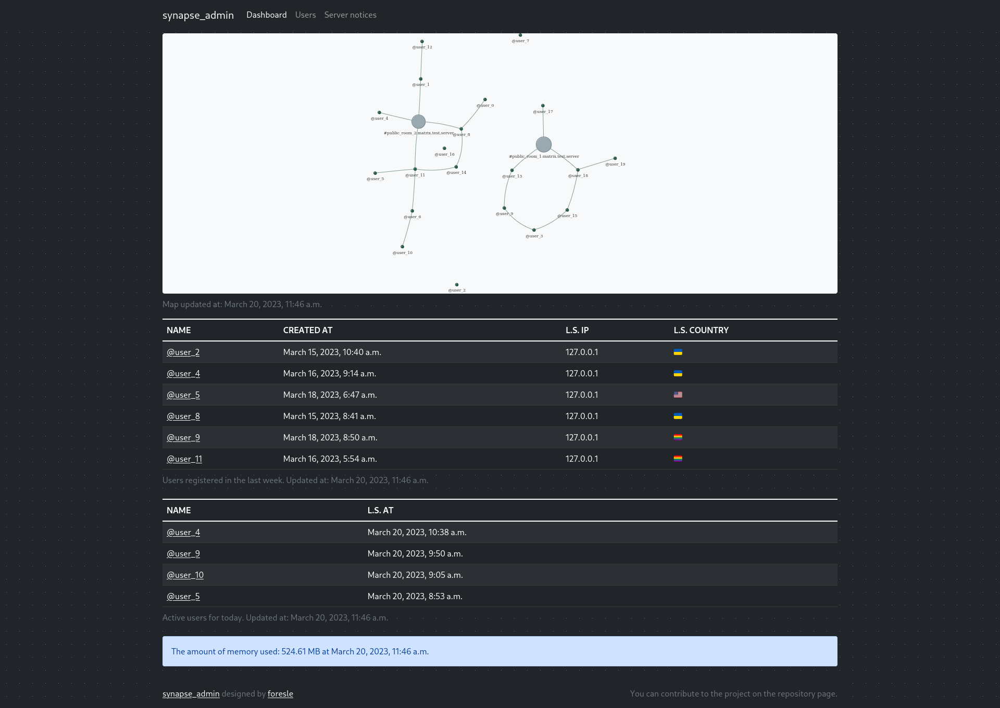
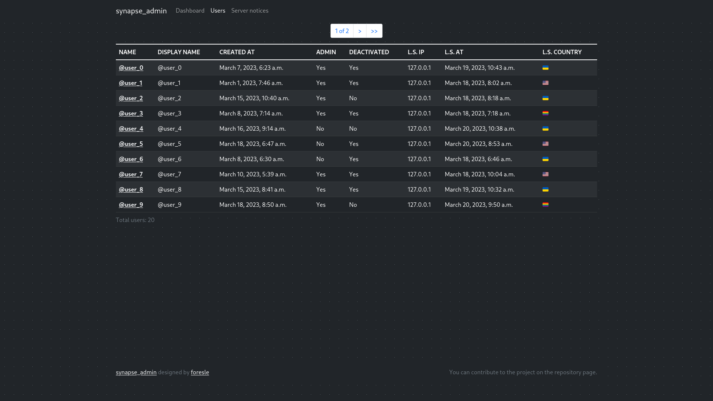
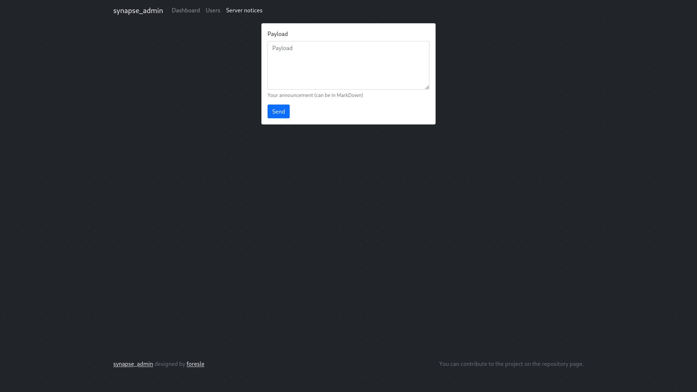
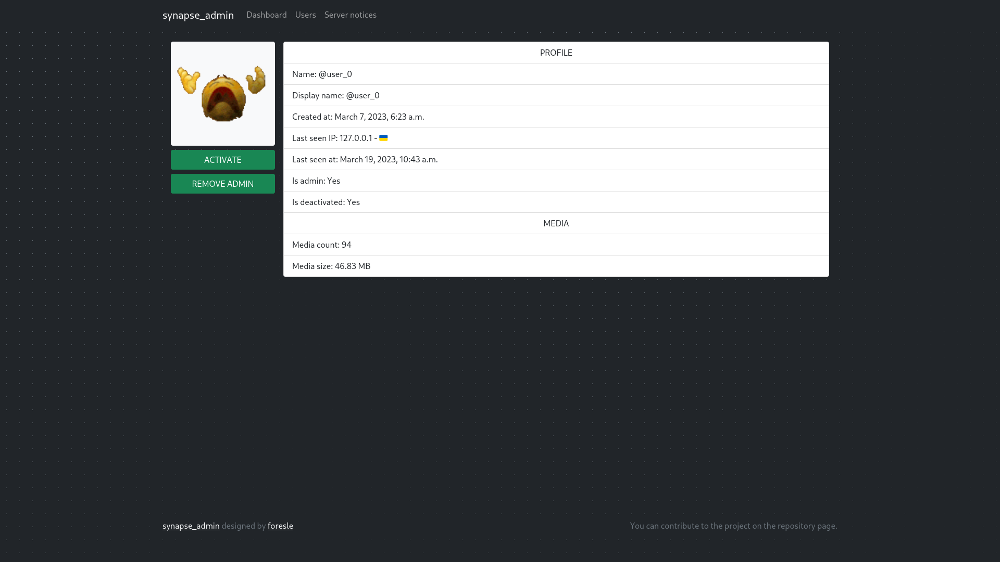
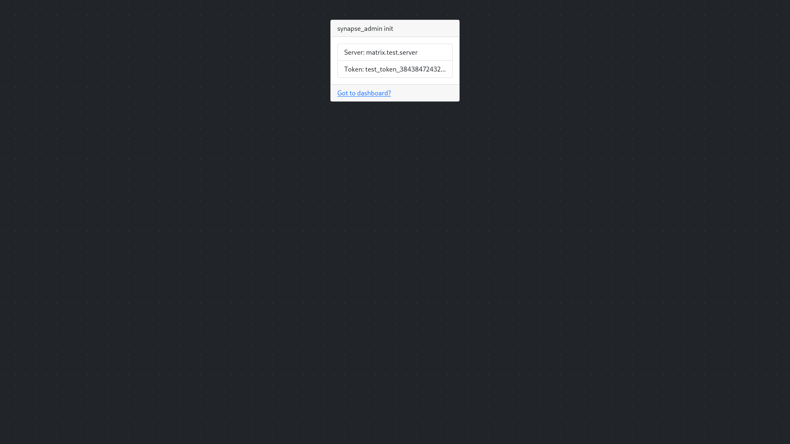

# synapse_admin

"synapse_admin" is a web-based administration tool built using Django framework for managing Matrix Synapse servers. 

It provides an intuitive interface for managing user accounts, ~~rooms~~, ~~permissions~~, and other configurations. 

With features like real-time user activity monitoring and detailed logs, "synapse_admin" simplifies the management of Matrix Synapse servers, making it easier for administrators to manage their Matrix-based communication platforms. 

The project is open source and contributions are welcome from the community.

_Dashboard page_

_Users page_

_Server notices page_

_User page_

_Init page_